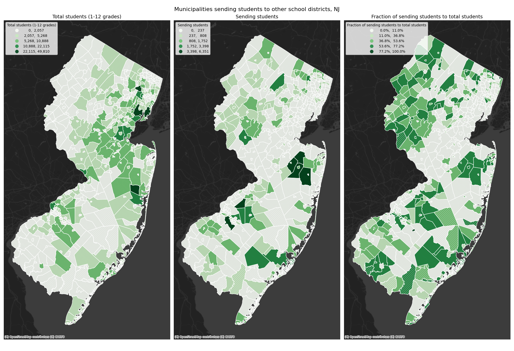

# Assignment 8
Command-line GIS, Fall 2023
Junghoon Lee

## Schools and School Districts in Hudson County, NJ 
This [map](school_districts_sending_receiving.html) shows municipalities sending their students to school districts other than their own K-12 districts.

- Data sources
  - Enrollment Data (2021): American Community Survey (via census API)
  - School district boundaries (2021): [National Center for Education Statistics](https://nces.ed.gov/programs/edge/Geographic/DistrictBoundaries)
  - Muncipal boundaries (2021): [NHGIS](https://www.nhgis.org/gis-files)
  
- Data Processing
  - I used geoprocessing tools (buffer, clip, intersection, and dissolve) to find which school districts contain which municipalities.
  - To identify the [sending-receiving relationship](https://en.wikipedia.org/wiki/Sending/receiving_relationship#:~:text=A%20sending%2Freceiving%20relationship%20is,part%20of%20a%20historical%20relationship.) between localities and school districts, I identified which grades each municipal school district does not have, which intersecting school districts can supplement the lack of grades, and estimated the relationship between the municipalities and school districts.
  - Using the estimated sending/receiving relationship, I calculated the number of sending students and the fraction of the sending students to the total students for each NJ municipality.
  - In the interactive map, I included my own estimation of the relationships as links between the centroids of municipalities and school districts.

### Static Map
- Municipalities with CVs greater than 40 are symbolized with hatches.

### Interactive Map
This interactive map shows some statistics about municipalities and the links between municipalities and school districts.
- Tooltips are implemented for the choropleth layers. You can see details of the choropleth layers by hovering over them.
- Popups are implemented for the sending-receiving link layer. You can see more information on each link by clicking on it.
<iframe src = 'school_districts_sending_receiving.html' width = 820 height = 820> </iframe>
